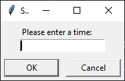
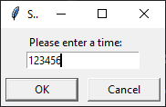
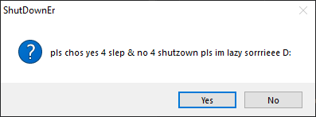
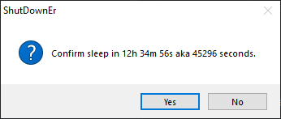
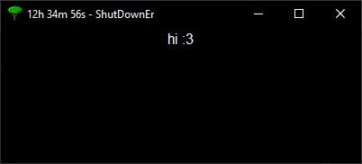

## Table of Contents
1. [Let's Get Right Into It](#lets-get-right-into-it)
   1. [Let's Go Through An Example](#lets-go-through-an-example)
   2. [The Beauty...](#the-beauty)
   3. [Uses](#uses)
2. [How to Install](#how-to-install)
3. [More Tools From Me](#more-tools-from-me)
4. [Support](#support)

## Quick Overview

What is _ShutDownEr_?

- Enter a time: with intuitive formatting
- Confirm mode: default is hibernate, the alternative is shutdown
- Confirm process: e.g. 'confirm sleep in 69h 4m 20s'
- Enjoy the final window: subtle in design, depicting the remaining time until the shutdown. Close this to abort shutdown.

More details, about the time formatting etc. below :)

## Let's Get Right To It

It's quite straight forward.

What makes _ShutDownEr_ unique is the way the time is formatted.

A table with examples should be clearer than any explanation:

| Input  | Rendered Time |
|--------|---------------|
|        |               |
| 45     | 45s           |
| 130    | 1m 30s        |
| 4500   | 45m 00s       |
| 13000  | 1h 30m 00s    |
| 123456 | 12h 34m 56s   |

You can even enter things like 90 seconds or 90 minutes.

| Input | Rendered Time |
|-------|---------------|
|       |               |
| 90    | 1m 30s        |
| 9000  | 1h 30m 00s    |
| 9090  | 1h 31m 30s    |

You can also add spaces wherever you like, if that's what you're into.

| Input                         | Rendered Time |
|-------------------------------|---------------|
|                               |               |
| 13000                         | 1h 30m 00s    |
| 1 30 00                       | 1h 30m 00s    |
| &nbsp; 13 &ensp; 0 &ensp; 0 0 | 1h 30m 00s    |

## Let's Go Through An Example
Upon starting _ShutDownEr_, we're greeted with this window.

Let's say we want to initiate a shutdown in 12h 34m 56s. So we enter:

and hit _enter_ or click _OK_.
 

### Hibernate or shut down
The two primary modes _ShutDownEr_ operates in are shutting down normally or hibernating, with the latter being the default.
In case you didn't know, hibernating is like sleeping, saving the windows and processes running, but as opposed to sleeping, hibernating

- consumes next to no power
- as a trade-off, takes the same amount to start as a regular shutdown
- but most importantly, your computer doesn't decide to go on a rave in your absence.

Here's a table for a swift overview.

| type      | saves status | fast boot | low energy consumption | that on kid with untreated ADHD |
|-----------|--------------|-----------|------------------------|---------------------------------|
| shut down | &#9744;      | &#9744;   | &#9745;                | &#9744;                         |
| hibernate | &#9745;      | &#9744;   | &#9745;                | &#9744;                         |
| sleep     | &#9745;      | &#9745;   | &#9744;                | &#9745;                         |

This matter is clearly depicted in the following window:

*just hit enter ok*

### Moving on xd

Then, _ShutDownEr_ informs us of the resulting time of the string we entered and asks us for confirmation.

In this example you can clearly see why this time format is substantially simpler than entering the required seconds for example.
 

Since the formatted time is correct, let's hit _enter_ again.

And there we go! Shutdown is initiated, with the remaining time being visible in the title of the window. 

Hovering over the windows icon in the taskbar shows us the remaining time as well.

To abort the shutdown, simply close the window, _ShutDownEr_ will then shut itself down instead *muhahaha*.

You can also quit _ShutDownEr_ by hitting the _Escape_ key.

### The nice thing...

...is how simple it is.

You can enter your desired time in a heartbeat because of the intuitive formatting, hit enter three times, and there you go.

The remaining time is visible at any point as well, and cancellation requires no more than a single click.

## How to Install

Simply download `ShutDownEr.exe` from the _Releases_ section, and you're good to go! No installation required, not even Python.

The first time running the `.exe` file you might get a warning saying that the app isn't recognized, but after clicking 'More Info' and 'Run anyway' the warning shouldn't pop up anymore.

The only way to get rid of the warning would require me to buy a yearly subscription costing hundreds of euros, and since this is free, open-source software, that isn't in the cards for now.

Alternatively, if you prefer using Python to run the program instead, clone the repository and simply run main.py, no additional packages required.

## More Tools From Me

If you enjoyed _ShutDownEr_, feel free to check out my other quality-of-life tools, all free and open-source as well, no ads and no nonsense.

- _Timerrhymer_: https://github.com/JohnStephens1/Timerrhymer
- _4Focus_: https://github.com/JohnStephens1/4Focus

## Support

If you found any of them useful, sharing my work with people who might profit from them as well would be highly appreciated.

Alternatively, any and every donation would mean a lot and help me keep making more tools like them.

https://www.paypal.com/donate/?hosted_button_id=L4X2DFAYMJ72U